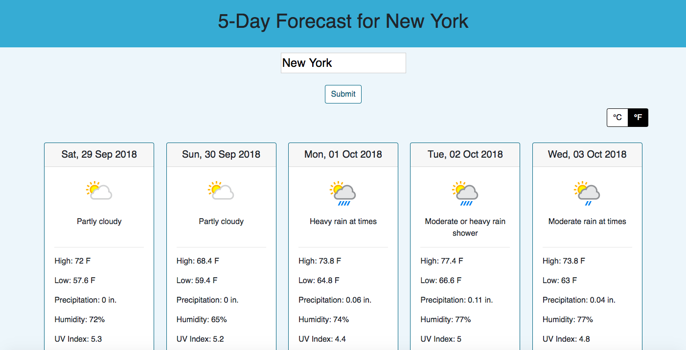

# 5-Day Forecast

Get the 5-day forecast by city. 

## Demo

Visit the live site: https://forecast-five-day.herokuapp.com/

## Features

* Temperature Units (Celsius or Fahrenheit)
* Precipitation
* Humidity
* UV Index
* Sunrise and sunset times
* Responsive Web Design 

## Technologies

* React JS
* Bootstrap
* Font Awesome
* Node
* Express
* [APIXU Weather API](https://www.apixu.com/)

## Installation

1. Clone the master branch of this repository.
2. Open a terminal for the server.
    * `npm start`
3. Open a second terminal for the client side.
    * `cd client`
    * `npm start`

## Thought Process

1. Find a free alternative to the Open Weather Map API, which is now requires a paid subscription for some services.
    * Chose APIXU for its similarities to Open Weather Map, price (free), and ease of use.
    * Tested API with Postman.
2. Chose to have users search by city.
    * This is the easiest query for users to search by, in comparsion to coordinates or zipcode.
3. Chose data from the API request.
    * Decided on the most needed info for the day.
4. Chose to have a default city (New York) on website load.
    * When users vist the site, that will be the forecast they see. 
5. Determined error messages.
    * Included a loading page.
    * Included a techincal difficulties page.
6. Determined technologies and architecture of single page app.
    * Chose a full stack app.
    * Chose frameworks and libraries.
7. Used GitHub to track coding history and for version control.
8. Deployed to Heroku.

## Tradeoffs 

1. API
    * Open Weather Map's 16-day API is now a paid subscription, so I serached for an alternative that functioned in a similar way.

## Future Implementations

1. Only the 5-day forecast part of the page should reload. Not the whole page.
2. Use SASS for easier implementation of CSS.
3. Separate more of the features into separate, functional components.
    * Will make the code easier to read.
4. Get all info above the fold for the desktop version.
5. For mobile, show less information since display is a single-column.
    * Let users press a button to see additional info.